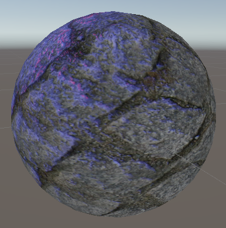

# HLSL-Basic-Light-Model

**Основные компоненты освещения**
Стандартная модель освещения состоит из трех ключевых компонентов:

  * Ambient Light (Фоновое освещение) - равномерное освещение без направления, имитирующее рассеянный свет в окружающей среде
  * Diffuse Light (Рассеянный свет) - свет, равномерно отражающийся от поверхности в зависимости от угла падения
  * Specular Light (Зеркальный свет) - блики, возникающие при отражении света от поверхности

```hlsl
float4 AmbientColor = (0.25f, 0.25f, 0.25f, 1.0f);
float4 DiffuseColor = (1.0f, 1.0f, 1.0f, 1.0f); 
float4 SpecularColor = (1.0f, 1.0f, 1.0f, 1.0f);
float Glossiness = 20.0; // Контролирует резкость бликов
```

**Принципы реализации**
1. Фоновое освещение (Ambient)
Самый простой компонент, который добавляет базовый уровень освещенности ко всем поверхностям независимо от их ориентации или положения относительно источников света.

2. Рассеянный свет (Diffuse)
Рассчитывается на основе:
 - Угла между нормалью поверхности и направлением к источнику света (закон Ламберта)
 - Цвета поверхности (из текстуры)
 - Цвета и интенсивности источника света

```hlsl
Использует закон Ламберта:

float diffuselight = saturate(dot(N,L));
float4 Diffuse = diffuselight * DiffuseColor * ColorTexture * lightColor;
```

3. Зеркальные блики (Specular)
Зависит от:
  - Угла между направлением отраженного света и направлением к камере
  - "Глянцевости" поверхности (параметр Glossiness)
  - Интенсивности бликов (Specular Color)

```hlsl
Модель Блинна-Фонга:

float H = normalize(L + V);
float NdotH = saturate(dot(N, H));
float gloss = Glossiness * SpecularTexture.a;
float SpecPower = pow(NdotH, gloss);
 
float4 Specular = SpecPower * SpecularColor * SpecularTexture;
```

**Технические аспекты**
Шейдер состоит:
  - Вершинный шейдер для преобразования координат и расчета векторов
  - Пиксельный шейдер для вычисления итогового цвета каждого пикселя
  - Поддержку текстур (диффузная, зеркальная, нормалей)
  - Настройки материалов (цвета, глянцевость)
  - Параметры источников света (положение, цвет)

**Используются три типа текстур**
  - diffuseMap - основная текстура цвета
  - specularMap - карта бликов (альфа-канал влияет на интенсивность)
  - normalMap - карта нормалей (преобразуется из [0,1] в [-1,1])

**Структуры**
```hlsl
struct a2v
{
  float4 position : POSITION;
  float4 texCoord : TEXCOORD0;
  float4 normal : NORMAL;  
  float4 binormal : BINORMAL;
  float4 tangent : TANGENT;
};

struct v2f
{
  float4 position : POSITION;
  float2 texCoord : TEXCOORD0;
  float3 lightVec : TEXCOORD1;
  float3 eyeVec : TEXCOORD2;
  float3 worldNormal : TEXCOORD3;
  float3 worldBinormal : TEXCOORD4;
  float3 worldTangent : TEXCOORD5;
};
```
**Вершинный шейдер**
Выполняет:
  - Преобразование нормалей, тангентов и бинормалей в мировое пространство
  - Расчёт векторов к свету и камере
  - Передачу текстурных координат

```hlsl
v2f v(a2v In, uniform float4 lightPosition)
{
  v2f Out;
  Out.wordNormal = mul(In.normal, WorldInverseTranspose).xyz;
  Out.wordBiNormal = mul(In.binormal, WorldInverseTranspose).xyz;
  Out.wordTangent = mul(In.tangent, WorldInverseTranspose).xyz;
 
  float3 worldSpacePos =  mul(In.position, World);
 
  Out.lightVec = lightPosition - worldSpacePos;
  Out.eyeVec = VievInverse[3] - worldSpacePos;
  Out.texCoord.xy = In.texCoord;
  Out.position = mul(In.position, WorldViewProjection);
 
  return Out;
}
```

**Пиксельный шейдер**
Пиксельный шейдер вычисляет итоговое освещение:
  - Диффузная составляющая рассчитывается через dot(N,L)
  - Спекулярная составляющая использует полувектор H и степень Glossiness
  - Нормали из карты нормалей преобразуются с учётом TBN-матрицы

```hlsl
float4 f(v2f In, uniform float4 lightColor) : COLOR
{
  float4 ColorTexture = tex2D(diffuseMapSampler, In.texCoord.xy);
  float4 SpecuarTexture = tex2D(specularMapSampler, In.texCoord.xy);
  float3 normal = tex2D(normalMapSampler, In.texCoord).xyz * 2.0 - 1;
 
  float3 Nn = In.worldNormal;
  float3 Bn = In.worldBinormal;
  float3 Tn = In.worldTangent;
 
  float3 N = (normal.z * Nn) + (normal.x * Bn) + (normal.y * -Tn);
  N = normalize(N);
 
  float3 L = normalize(In.lightVec.xyz);
  float3 V = normalize(In.eyeVec.xyz);
 
  float4 Ambient = AmbientColor * ColorTexture;
 
  float diffuselight = saturate(dot(N,L));
  float4 Diffuse = diffuselight * DiffuseColor * ColorTexture * lightColor;
 
  float H = normalize(L + V);
  float NdotH = saturate(dot(N, H));
  float gloss = Glossiness * SpecularTexture.a;
  float SpecPower = pow(NdotH, gloss);
 
  float4 Specular = SpecPower * SpecularColor * SpecularTexture;
 
  return (Ambient + Diffuse + Specular) * lightColor;
}
```
<p align="center">

</p>

